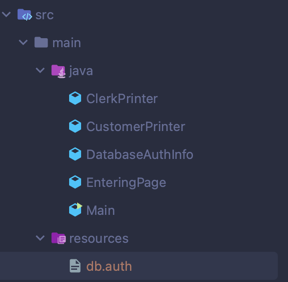
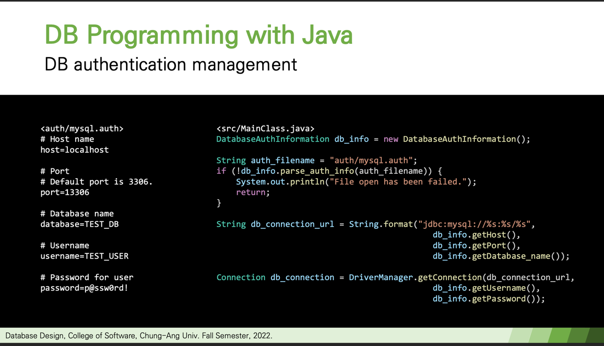
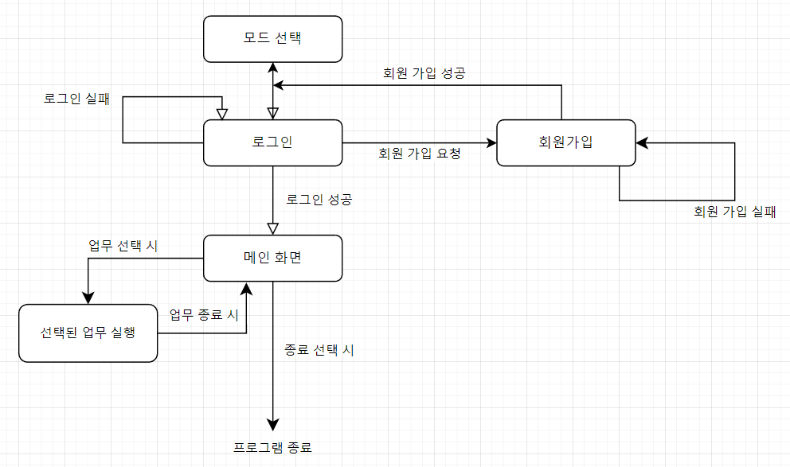

# DB_design_project

## 파일 구조


## 유의 사항
1. <span style="color:red">소스코드는 편집 X</span>, db.auth파일에 자신의 db정보를 입력
   1. DatabaseAuthInfo가 db.auth파일을 읽음.(참고: 수업자료 중 08.db_programming_cont.pdf-17page)
   
   2. '설정=값'형태로 입력.
2. db테이블의 각 도메인의 타입에 맞게 입력해줘야 오류 발생X
    1. varchar이면 문자열만, int면 숫자만
````
#db 연결 설정

#Host name
host=호스트명

#Port
#Default port is 3306.
port=포트번호

# Database name
database=데이터베이스이름

# Username
username=유저이름

# Password for user
password=비밀번호
````

## 프로그램 구조
